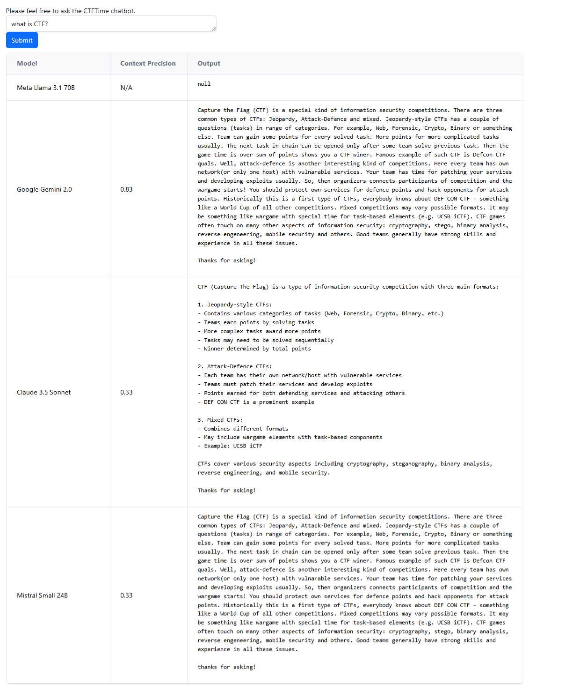

## What is this?
This is a self-study RAG project of building Q&A chatbot for CTFtime platform. Users can input a prompt to ask about CTFtime with reference to their FAQ section https://ctftime.org/faq/.



## TODO
Model evaluation will be done and more models will be available.

## How to run
Current dockerfile requires the gpu, and so for safety you could follow the below config for setting up nvidia for docker. Theoretically since it's using OpenRouter for LLM inference APIs, GPU should be not a prerequisite and I may change the docker image later.

### Setup nvidia for docker
https://docs.nvidia.com/datacenter/cloud-native/container-toolkit/latest/install-guide.html

```
curl -fsSL https://nvidia.github.io/libnvidia-container/gpgkey | sudo gpg --dearmor -o /usr/share/keyrings/nvidia-container-toolkit-keyring.gpg \
  && curl -s -L https://nvidia.github.io/libnvidia-container/stable/deb/nvidia-container-toolkit.list | \
    sed 's#deb https://#deb [signed-by=/usr/share/keyrings/nvidia-container-toolkit-keyring.gpg] https://#g' | \
    sudo tee /etc/apt/sources.list.d/nvidia-container-toolkit.list
sudo apt-get update
sudo apt-get install -y nvidia-container-toolkit

sudo nvidia-ctk runtime configure --runtime=docker
sudo systemctl restart docker
# check and list gpus
docker run -it --rm --gpus all ubuntu nvidia-smi
```

### check your CUDA version
`nvcc --version`

then go to https://hub.docker.com/r/nvidia/cuda/tags to choose the appropriate image and modify the `Dockerfile` if needed

### Build and run the docker
```
git clone https://github.com/aa-crypto-ai/ctftime-chatbot.git
cd ctftime-chatbot
cp sample.env master.env
# put your OpenRouter API key to master.env
docker-compose up --build
```

Note: sometimes OpenRouter API would fail to give an response, please keep retrying
